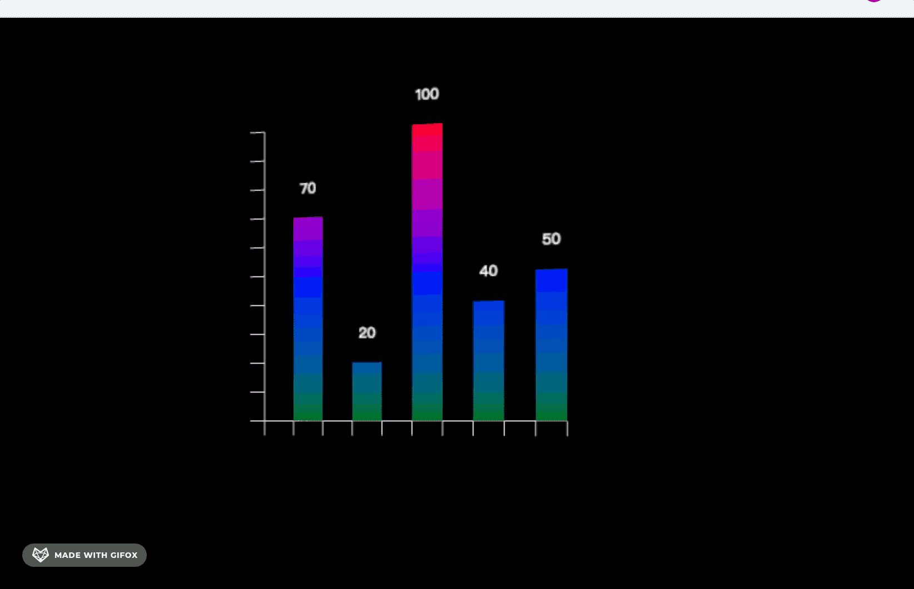
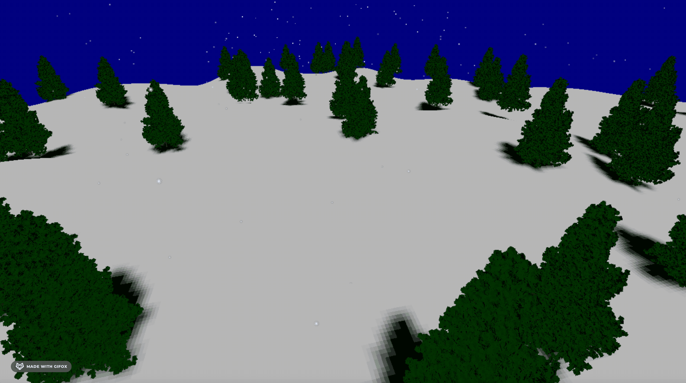
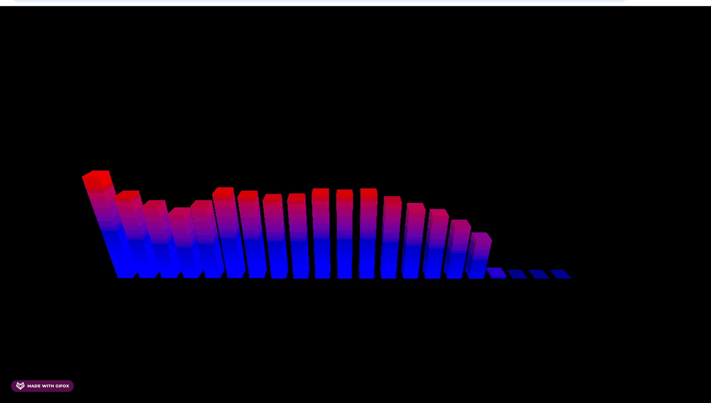

# threejs-course-code
<!-- 
掘金小册[《Three.js 通关秘籍》](https://juejin.cn/book/7481132169944498226)案例代码 

npx live-server 起个静态服务就可以访问

如果是 vite 项目，那就先 npm install 再 npm run dev

[第一个 3D 场景](./first-scene/)

[dat.gui 可视化调试](./data-gui/)

[深入理解透视相机和视椎体](./perspective-camera/)

[BufferGeometry：顶点生成几何体](./buffer-geometry/)

[点模型、线模型、网格模型](./point-line-mesh/)

[实战：随机山脉地形](./mountain-terrain/)


[材质颜色和纹理贴图](./material-color-texture/)

[uv 坐标和 uv 动画](./texture-uv/)

[如何画各种曲线](./curve/)

[按照规律生成各种几何体](./generate-geometry/)

[实战：隧道穿梭](./tube-travel/)


[uv 动画实战：无限隧道穿梭](./infinite-tunnel/)


[实战：盖房子](./house/)


[场景遍历和世界坐标](./scene-group/)

[各种灯光和常用 helper](./light-helper/)

[顶点法线和反射原理](./vertex-normal/)

[自定义顶点颜色实现渐变](./geometry-color)

[实战：颜色渐变柱状图](./gradient-color-bar-chart/)



[如何加载外部模型](./gltf-model/)

[gltf 的三种文件结构](./gltf-structure/)

[gltf-pipeline: 处理 gltf 模型的工具](./gltf-pipeline-test/)

[DRACO：压缩 gltf 模型，提升加载性能](./gltf-draco-test/)

[正投影相机和 3 种灯光的阴影](./orthographic-camera-shadow/)

[OrbitControl 的常用属性方法](./orbit-controls/)

[射线与点击选中 3D 场景的物体](./ray-caster/)

[后期处理与描边发光效果](./post-processing/)

[各种后期处理效果](./all-pass/)

[精灵模型 Sprite 和下雪效果](./sprite/)

[实战：林海雪原](./snowy-forest/)



[几何体材质共用问题和 copy、clone](./material-share/)

[补间动画库 Tween.js](./tween-animation/)

[Tween.js 常用 API](./tween-all-feature/)

[关键帧动画和模型动画播放](./keyframes-animation/)

[丝滑入场动画](./tube-entry-animation/)


[改变顶点的变形动画](./morph-animation/)

[骨骼动画：关节带动顶点运动](./bone-animation/)

[CSS2DRenderer 实现标注：给 3D 物体加标签](./css2d-annotation/)

[CSS3DRenderer 实现标注：电视内容、公告栏内容](./css3d-annotation/)

[Sprite 结合 canvas 实现各种形状的标注](./canvas-sprite-annotation/)

[SpriteText：开箱即用的文字组件](./sprite-text-test/)

[实战：数字雨](./number-rain)


[Canvas 画各种图案作为纹理](./canvas-texture/)

[3D 场景如何加入音频](./audio-api/)

[实战：3D 饼图](./3d-pie-chart/)


[系统掌握噪声库 Simplex Noise](./simplex-noise-test/)

[实战:双人斗舞](./two-dancer/)


[音乐频谱可视化](./audio-analyser/)



[PBR 材质：逼真的金属、塑料、磨砂、喷漆、玻璃效果](./pbr-material/)

[PBR 实战：汽车选配](./car-config/)

[模型搜索和导入 blender 编辑](./model-download-edit/)

[MatCap 材质：通过光泽球实现伪光照效果](./matcap-material/)

[HDR：亮度范围更广的全景图](./hdr-background/)

[CubeCamera 实现镜子效果](./cube-camera-envmap/)

[Reflector 实现镜子效果](./reflector-mirror/)

[实战：练舞房](./dancing-mirror/)


[3d 音乐播放器](./3d-music-player/)


[Three.js 的各种控制器 Controls](./all-controls/)

[React 和 Three.js 集成](./react-three-app/)

[Three.js Editor](./threejs-editor/)


[酷家乐装修编辑器](./home-decoration-editor/)

[物理引擎 cannon：实现真实世界的物理现象](./cannon-world/)

[物理引擎 cannon：凸多面体实现各种形状](./cannon-world/) -->

```
├── 控制器类型
│   ├── OrbitControls 做相机的旋转、放缩，物体的平移
│   ├── lyControls：飞行控制器，通过上下左右键和鼠标来控制前进后退、方向旋转
│   ├── FirstPersonControls：类似飞行控制器，但是上下角度不能超过 90 度
│   ├── MapControls： 和 OrbitControls 一样，但是左键平移，右键旋转
│   ├── TransformControls：用来移动、缩放、旋转场景中的物体
│   ├── DragControls：用来拖动场景中的物体
基础组件创建
├── 场景（Scene）
│   ├── 作用：作为 3D 世界的容器，存放所有 3D 对象、灯光和相机
│   ├── 创建步骤
│   │   └── 示例代码：const scene = new THREE.Scene();
│   └── 参数：无
├── 相机（Camera）
│   ├── 透视相机（PerspectiveCamera）
│   │   ├── 作用：模拟人眼观察世界的方式，产生近大远小的透视效果
│   │   ├── 创建步骤
│   │   │   └── 示例代码：const camera = new THREE.PerspectiveCamera(fov, aspect, near, far);
│   │   └── 参数说明
│   │       ├── fov：垂直视野角度，单位为度，控制视野范围大小，值越大看到的场景越广
│   │       ├── aspect：宽高比，通常为渲染区域宽度除以高度，影响场景的比例
│   │       ├── near：近裁剪面距离，距离相机小于该值的物体不会被渲染
│   │       └── far：远裁剪面距离，距离相机大于该值的物体不会被渲染
│   ├── 正交相机（OrthographicCamera）
│   │   ├── 作用：物体大小不会随距离变化，常用于 2D 游戏或 UI 渲染
│   │   ├── 创建步骤
│   │   │   └── 示例代码：const camera = new THREE.OrthographicCamera(left, right, top, bottom, near, far);
│   │   └── 参数说明
│   │       ├── left：左裁剪面位置
│   │       ├── right：右裁剪面位置
│   │       ├── top：上裁剪面位置
│   │       ├── bottom：下裁剪面位置
│   │       ├── near：近裁剪面距离
│   │       └── far：远裁剪面距离
│   └── 设置相机位置和朝向
│       ├── 设置位置
│       │   └── 示例代码：camera.position.set(x, y, z);
│       │       ├── x：X 轴坐标
│       │       ├── y：Y 轴坐标
│       │       └── z：Z 轴坐标
│       └── 设置朝向
│           └── 示例代码：camera.lookAt(x, y, z);
│               ├── x：看向点的 X 轴坐标
│               ├── y：看向点的 Y 轴坐标
│               └── z：看向点的 Z 轴坐标
├── 渲染器（Renderer）
│   ├── WebGL 渲染器（WebGLRenderer）
│   │   ├── 作用：将 3D 场景渲染为 2D 图像
│   │   ├── 创建步骤
│   │   │   └── 示例代码：const renderer = new THREE.WebGLRenderer(options);
│   │   └── 参数说明（options 对象）
│   │       ├── antialias：布尔值，是否开启抗锯齿，默认 false
│   │       ├── alpha：布尔值，是否开启透明背景，默认 false
│   │       ├── precision：字符串，着色器精度，可选 'highp'、'mediump'、'lowp'，默认 'highp'
│   │       └── ... 其他可选参数
│   └── 设置渲染尺寸
│       ├── 步骤
│       │   └── 示例代码：renderer.setSize(width, height);
│       └── 参数说明
│           ├── width：渲染区域的宽度
│           └── height：渲染区域的高度
├── 几何体（Geometry）与材质（Material）及网格（Mesh）
│   ├── 几何体（Geometry）
│   │   ├── 立方体几何体（BoxGeometry）
│   │   │   ├── 作用：创建立方体形状的几何体
│   │   │   ├── 创建步骤
│   │   │   │   └── 示例代码：const geometry = new THREE.BoxGeometry(width, height, depth, widthSegments, heightSegments, depthSegments);
│   │   │   └── 参数说明
│   │   │       ├── width：X 轴方向尺寸
│   │   │       ├── height：Y 轴方向尺寸
│   │   │       ├── depth：Z 轴方向尺寸
│   │   │       ├── widthSegments：X 轴分段数，默认 1
│   │   │       ├── heightSegments：Y 轴分段数，默认 1
│   │   │       └── depthSegments：Z 轴分段数，默认 1
│   │   ├── 球体几何体（SphereGeometry）
│   │   │   ├── 作用：创建球体形状的几何体
│   │   │   ├── 创建步骤
│   │   │   │   └── 示例代码：const geometry = new THREE.SphereGeometry(radius, widthSegments, heightSegments);
│   │   │   └── 参数说明
│   │   │       ├── radius：球体半径
│   │   │       ├── widthSegments：水平分段数，默认 32
│   │   │       └── heightSegments：垂直分段数，默认 16
│   │   └── 平面几何体（PlaneGeometry）
│   │       ├── 作用：创建平面形状的几何体
│   │       ├── 创建步骤
│   │       │   └── 示例代码：const geometry = new THREE.PlaneGeometry(width, height, widthSegments, heightSegments);
│   │       └── 参数说明
│   │           ├── width：X 轴方向尺寸
│   │           ├── height：Y 轴方向尺寸
│   │           ├── widthSegments：X 轴分段数，默认 1
│   │           └── heightSegments：Y 轴分段数，默认 1
│   ├── 材质（Material）
│   │   ├── MeshBasicMaterial
│   │   │   ├── 定义：不受光照影响的基础材质，仅显示颜色或纹理
│   │   │   ├── 使用：简单形状展示、调试、快速显示不考虑光照的物体
│   │   │   ├── 参数：color（颜色）、map（纹理贴图）、transparent（是否透明）等
│   │   │   ├── 场景：2D 效果、UI 元素、快速原型开发
│   │   │   ├── 注意点：不受光照影响，无法呈现真实 3D 效果
│   │   │   └── 区别：最基础，不考虑光照计算
│   │   └── MeshNormalMaterial
│   │       ├── 定义：根据物体法线方向生成颜色的材质，用于调试
│   │       ├── 使用：查看物体法线方向、检测模型问题
│   │       ├── 参数：flatShading（是否平面着色）等
│   │       ├── 场景：模型开发、法线可视化
│   │       ├── 注意点：仅用于调试，无实际渲染意义
│   │       └── 区别：基于法线生成颜色，视觉效果独特
├── │   光照材质
│   │   ├── MeshLambertMaterial
│   │   │   ├── 定义：基于 Lambert 光照模型，模拟漫反射效果
│   │   │   ├── 使用：创建不反光物体，如石头、布料
│   │   │   ├── 参数：color、map、emissive（自发光颜色）等
│   │   │   ├── 场景：模拟粗糙表面物体
│   │   │   ├── 注意点：不考虑镜面反射和高光效果
│   │   │   └── 区别：与 Phong 材质相比，无镜面反射
│   │   ├── MeshPhongMaterial
│   │   │   ├── 定义：基于 Phong 光照模型，模拟漫反射和镜面反射
│   │   │   ├── 使用：创建有光泽物体，如金属、塑料
│   │   │   ├── 参数：color、map、shininess（光泽度）等
│   │   │   ├── 场景：模拟光滑表面物体
│   │   │   ├── 注意点：计算量比 Lambert 材质大
│   │   │   └── 区别：增加了镜面反射效果
│   │   ├── MeshStandardMaterial
│   │   │   ├── 定义：基于物理的标准材质，支持 PBR
│   │   │   ├── 使用：创建更真实物体，如木材、玻璃
│   │   │   ├── 参数：color、map、roughness（粗糙度）、metalness（金属度）等
│   │   │   ├── 场景：大多数需要真实感的 3D 场景
│   │   │   ├── 注意点：需要合适光照和纹理体现效果
│   │   │   └── 区别：引入粗糙度和金属度，符合物理规律
│   │   └── MeshPhysicalMaterial
│   │       ├── 定义：MeshStandardMaterial 的扩展，增加更多物理属性
│   │       ├── 使用：创建复杂材质，如清漆、透明物体
│   │       ├── 参数：除 MeshStandardMaterial 参数外，clearcoat（清漆强度）、transmission（透明度）等
│   │       ├── 场景：需要高精度物理效果的场景
│   │       ├── 注意点：计算量较大
│   │       └── 区别：在 MeshStandardMaterial 基础上增加更多物理属性
└── 特殊材质
    ├── MeshMatcapMaterial
    │   ├── 定义：使用 Matcap 纹理模拟光照效果，不依赖场景光照
    │   ├── 使用：创建 2D 风格 3D 物体，如卡通风格模型
    │   ├── 参数：color、matcap（Matcap 纹理）等
    │   ├── 场景：低性能设备、2D 风格游戏
    │   ├── 注意点：视觉效果受 Matcap 纹理限制
    │   └── 区别：不依赖场景光照，计算量小
    ├── ShaderMaterial
    │   ├── 定义：允许自定义着色器的材质，灵活性高
    │   ├── 使用：创建复杂视觉效果，如流体、粒子效果
    │   ├── 参数：vertexShader（顶点着色器代码）、fragmentShader（片元着色器代码）等
    │   ├── 场景：需要高度定制化的渲染效果
    │   ├── 注意点：需要掌握 GLSL 语言，调试难度大
    │   └── 区别：可完全自定义渲染逻辑
    └── PointsMaterial
        ├── 定义：用于渲染点云的材质
        ├── 使用：创建星空、粒子系统等
        ├── 参数：color、size（点的大小）、sizeAttenuation（大小衰减）等
        ├── 场景：点云可视化、粒子效果
        ├── 注意点：大量点可能影响性能
        └── 区别：专门用于渲染点
│   └── 网格（Mesh）
│       ├── 作用：将几何体和材质组合成可渲染的 3D 对象
│       ├── 创建步骤
│       │   └── 示例代码：const mesh = new THREE.Mesh(geometry, material);
│       └── 参数说明
│           ├── geometry：几何体对象
│           └── material：材质对象
│       └── 添加到场景
│           └── 示例代码：scene.add(mesh);
```